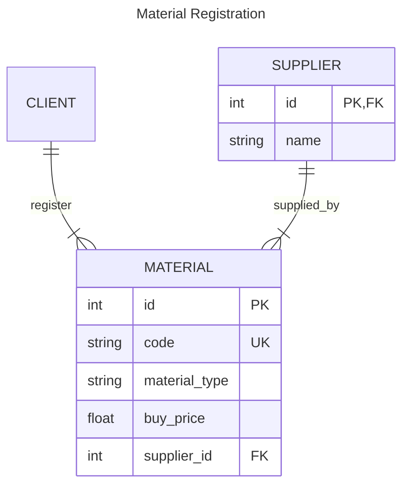

# ERD

```mermaid
---
title: Material Registration
---
erDiagram
    CLIENT ||--|{ MATERIAL : register
    MATERIAL {
        int    id               PK
        string code             UK
        string material_type
        float  buy_price
        int    supplier_id      FK

    }
    SUPPLIER ||--|{ MATERIAL : supplied_by
    SUPPLIER {
        int    id               PK, FK
        string name
    }
```